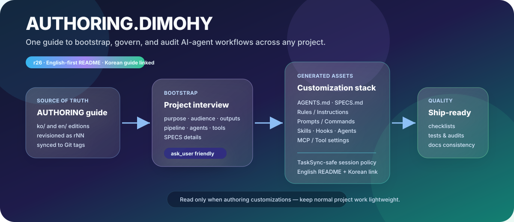

# AUTHORING.DIMOHY

AUTHORING.DIMOHY is a meta authoring guide for building consistent AI-agent customization workflows for any project. It helps agents create, update, and audit `AGENTS.md`, `SPECS.md`, rules/instructions, prompts(commands), chat modes, skills, hooks, subagents, and MCP/tool integrations.

Canonical repository: <https://github.com/dimohy/AUTHORING.DIMOHY>

> Korean guide: [`ko/README.md`](ko/README.md) · Korean source directory: [`ko/`](ko/)

   

## Guide locations

| Language | Location |
|---|---|
| English | [`en/`](en/) — use the newest `AUTHORING.DIMOHY.r*.md` file |
| Korean | [`ko/`](ko/) — use the newest `AUTHORING.DIMOHY.r*.md` file |

Last updated: **2026-04-28**

## When should agents read this guide?

Do **not** keep the full AUTHORING guide loaded during ordinary coding or writing sessions. Read it only when you are doing customization work, such as:

- bootstrapping `AGENTS.md`, `SPECS.md`, or `.github/` customization files for a new project;
- realigning existing rules, prompts(commands), skills, agents, hooks, and MCP/tool settings;
- auditing customization file structure, category coverage, or workflow consistency;
- updating AUTHORING.DIMOHY itself or bumping its revision.

During normal project work, the lightweight `AGENTS.md` in that project is the primary operating constitution.

## Quick start

### 1. Install into a new project

1. To use AUTHORING, open the canonical repository on the web, choose the newest localized guide from `en/` or `ko/`, then copy/download it into the target project root or reference that web file explicitly.
   - English: newest `en/AUTHORING.DIMOHY.r*.md`
   - Korean: newest `ko/AUTHORING.DIMOHY.r*.md`
2. In the target project, you may optionally keep the copied file as `AUTHORING.DIMOHY.md` for a stable local reference.
3. Ask your AI agent to bootstrap the project.
   - `Read AUTHORING.DIMOHY.md and create AGENTS.md for this project`
4. The agent should create `AGENTS.md`, optionally create `SPECS.md`, and offer project-appropriate agents, prompts, skills, hooks, chat modes, and tool settings.

### 2. Run interactive bootstrap

Use this when you want the agent to interview you before generating files:

- `Run AUTHORING`

Interactive bootstrap runs four steps:

1. clarify project purpose, audience, and outputs;
2. propose the recommended structure;
3. interview for `SPECS.md` details;
4. generate approved files after confirmation.

### 3. Realign an existing project

Use this when a project already has `AGENTS.md`, `.github/`, `.claude/`, `.cursor/`, or similar customization files:

- `realign this project with AUTHORING`

The agent should classify each asset as `keep / update / remove / missing`, present a change proposal, apply only approved changes, and re-audit afterward.

### 4. Suggest useful improvements upstream

If using AUTHORING in another project leads to a generally useful improvement, the upstream path is an Issue. External users submit reusable suggestions through Issues.

Ask the agent in the target project:

- `this AUTHORING improvement is useful upstream`
- `create an AUTHORING improvement issue`

The agent should let the user choose:

1. **Use only / no upstream** — keep the improvement in the current project only.
2. **Update local AUTHORING copy** — edit the copied `AUTHORING.DIMOHY*.md` in the current project only.
3. **Create upstream Issue** — create an Issue in <https://github.com/dimohy/AUTHORING.DIMOHY> when authenticated GitHub tooling is available.
4. **Prepare Issue draft** — generate the Issue title/body for manual submission when authentication or browser automation is unavailable.
5. **Skip / later** — do nothing now.

This repository includes `.github/ISSUE_TEMPLATE/authoring-improvement.yml` for structured Issue submissions. Maintainers can then use `.github/prompts/triage-authoring-issues.prompt.md` to read registered Issues, judge whether they are generally useful, and apply accepted changes to AUTHORING.DIMOHY.

## Managed categories

| Category | Example paths | Purpose |
|---|---|---|
| Operating constitution | `AGENTS.md` | Session, response style, `ask_user`, harness rules |
| Domain specs | `SPECS.md` | Project-specific outputs, paths, commands, acceptance criteria |
| Rules / Instructions | `.github/instructions/`, `.cursor/rules/`, `.claude/rules/` | Automatically injected context rules |
| Prompts / Commands | `.github/prompts/`, `.claude/commands/` | Reusable slash commands or task templates |
| Chat Modes | `.github/chatmodes/` | Special-purpose chat modes |
| Skills | `.github/skills/<name>/SKILL.md` | Procedural workflows with bundled assets |
| Hooks | `.github/hooks/`, `.claude/hooks/` | Lifecycle checks or transformations |
| Agents | `.github/agents/`, `.claude/agents/` | Specialized subagents |
| MCP / Tools | `.vscode/mcp.json`, `.mcp.json` | External docs, browser, APIs, build/test tools |

## TaskSync session-number fix

The current guide includes explicit TaskSync safeguards and the Issue-only upstream contribution flow:

- reuse the injected or returned `session_id`;
- do not resend `session_id: "auto"` during a normal conversation;
- do not confuse UI labels such as `AGENT 1` or `AGENT 2` with `session_id`;
- if the `ask_user` schema has no `options` field, write numbered choices in the question body;
- preserve the exact `session_id` during summaries, handoffs, and compaction;
- when a reusable AUTHORING improvement is found, let the user choose local-only use, local AUTHORING copy update, upstream Issue creation, Issue draft preparation, or skip/later.

## Revision and localization policy

AUTHORING.DIMOHY uses simple revision identifiers: `r1`, `r2`, `r3`, ... . The `r` prefix is part of the identifier.

Whenever a revision changes, update all of the following together:

- `en/AUTHORING.DIMOHY.rNN.md`
- `ko/AUTHORING.DIMOHY.rNN.md`
- this `README.md`
- `ko/README.md`
- Git tag `rNN`
- remote `main` branch

A release is not complete if only one language is updated.

Revision history is recorded in [`HISTORY.md`](HISTORY.md). Korean history is recorded in [`ko/HISTORY.md`](ko/HISTORY.md).

To reduce revision-churn, user-facing docs should avoid hard-coding the current revision number. Outside the localized AUTHORING file title/metadata, the revisioned filename itself, and revision history entries, prefer language directory links such as `en/` and `ko/`, or generic selectors such as `AUTHORING.DIMOHY.r*.md`.

## License

Apache License 2.0. See [`LICENSE`](LICENSE) for the full text.
