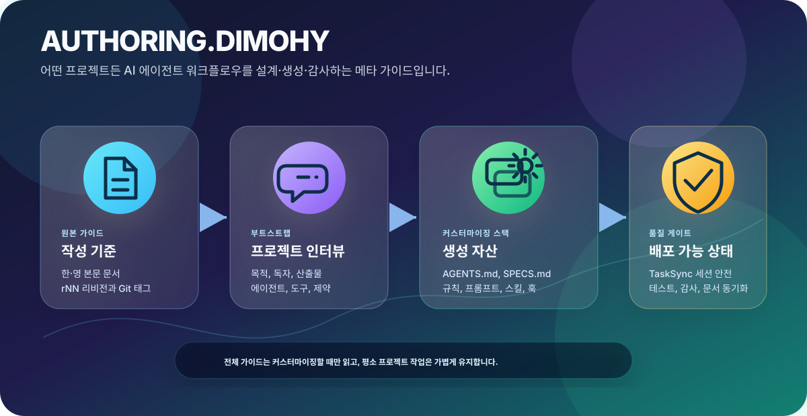

# AUTHORING.DIMOHY 한국어 안내

AUTHORING.DIMOHY는 어떤 프로젝트든 AI 에이전트 커스터마이징 워크플로우를 일관되게 구성하기 위한 메타 작성 가이드입니다. `AGENTS.md`, `SPECS.md`, rules/instructions, prompts(commands), chat modes, skills, hooks, subagents, MCP/tool 설정까지 생성·수정·감사하는 기준을 제공합니다.

정식 저장소: <https://github.com/dimohy/AUTHORING.DIMOHY>

> 기본 README는 영어입니다: [`../README.md`](../README.md)  
> 한국어 본문 디렉터리: [`./`](./)

   

## 가이드 위치

| 언어 | 위치 |
|---|---|
| 한국어 | [`ko/`](./) — 최신 `AUTHORING.DIMOHY.r*.md` 파일 사용 |
| English | [`en/`](../en/) — 최신 `AUTHORING.DIMOHY.r*.md` 파일 사용 |

최종 수정일: **2026-04-28**

## 언제 읽어야 하나요?

`AUTHORING.DIMOHY` 전체 문서는 평소 코딩/문서작성 대화에 항상 넣지 않습니다. 토큰을 아끼기 위해 다음 상황에서만 읽습니다.

- 새 프로젝트에 `AGENTS.md`, `SPECS.md`, `.github/` 커스터마이징 구조를 만들 때
- 기존 프로젝트의 rules, prompts(commands), skills, agents, hooks, MCP/tool 설정을 재정비할 때
- 커스터마이징 문서의 형식·원칙·카테고리를 감사할 때
- `AUTHORING.DIMOHY` 자체를 업데이트하거나 리비전을 올릴 때

일반 작업 중에는 각 프로젝트의 `AGENTS.md`가 가벼운 운영 헌법 역할을 합니다.

## 빠른 사용법

### 1. 새 프로젝트에 설치

1. AUTHORING을 사용하려면 웹에서 정식 저장소를 열고 `ko/` 또는 `en/`의 최신 언어별 가이드를 고른 뒤, 대상 프로젝트 루트에 복사/다운로드하거나 웹 파일을 명시적으로 참조합니다.
   - 한국어: 최신 `ko/AUTHORING.DIMOHY.r*.md`
   - English: 최신 `en/AUTHORING.DIMOHY.r*.md`
2. 대상 프로젝트에서는 안정적인 로컬 참조를 위해 복사한 파일명을 선택적으로 `AUTHORING.DIMOHY.md` 로 둘 수 있습니다.
3. 대상 프로젝트의 AI 채팅에서 다음처럼 요청합니다.
   - `# AUTHORING.DIMOHY.md를 읽고 이 프로젝트의 AGENTS.md를 생성해줘`
   - `Read AUTHORING.DIMOHY.md and create AGENTS.md for this project`
4. 에이전트가 프로젝트 성격을 확인한 뒤 `AGENTS.md`, 선택적 `SPECS.md`, 필요한 agents/prompts/skills/hooks/tool 설정을 생성합니다.

### 2. 대화형 부트스트랩

프로젝트 목적부터 산출물 경로, 설치할 서브에이전트, 스킬, 프롬프트까지 인터뷰를 통해 정하고 싶다면 다음처럼 요청합니다.

- `AUTHORING 실행해줘`
- `Run AUTHORING`

대화형 플로우는 네 단계로 진행됩니다.

1. 프로젝트 목적과 사용자/독자 파악
2. 권장 구조 제안 및 확인
3. `SPECS.md` 상세 인터뷰
4. 확정 후 파일 일괄 생성

### 3. 기존 프로젝트 재조정

이미 `AGENTS.md`나 `.github/` 구조가 있는 프로젝트에서는 다음처럼 요청합니다.

- `정비해줘`
- `AUTHORING 기준으로 맞춰줘`
- `realign this project with AUTHORING`

에이전트는 기존 파일을 `keep / update / remove / missing`으로 분류하고, 변경 제안표를 보여준 뒤 승인된 항목만 반영합니다.

### 4. 유용한 개선을 업스트림에 제안

다른 프로젝트에서 AUTHORING을 사용하다가 공통으로 유용한 개선을 발견했다면, 업스트림 경로는 Issue입니다. 일반 외부 사용자는 재사용 가능한 제안을 Issue로 등록합니다.

대상 프로젝트의 에이전트에게 다음처럼 요청할 수 있습니다.

- `이 AUTHORING 개선을 이슈로 제안해줘`
- `create an AUTHORING improvement issue`
- `this AUTHORING improvement is useful upstream`

에이전트는 먼저 범위를 선택하게 해야 합니다.

1. **사용만 / 업스트림 제안 안 함** — 개선을 현재 프로젝트에만 유지.
2. **로컬 AUTHORING 사본 수정** — 현재 프로젝트의 `AUTHORING.DIMOHY*.md` 사본만 수정.
3. **업스트림 Issue 생성** — 인증된 GitHub 도구가 있으면 <https://github.com/dimohy/AUTHORING.DIMOHY> 에 Issue 등록.
4. **Issue 초안 준비** — 인증이나 브라우저 자동화가 없으면 사용자가 수동 등록할 제목/본문 생성.
5. **건너뜀 / 나중에** — 지금은 아무것도 하지 않음.

이 저장소는 구조화된 제안을 위해 `.github/ISSUE_TEMPLATE/authoring-improvement.yml` 를 제공합니다. Maintainer는 `.github/prompts/triage-authoring-issues.prompt.md` 를 사용해 등록된 Issue를 읽고, 타당성과 범용성을 판단한 뒤 승인된 변경만 AUTHORING.DIMOHY에 반영할 수 있습니다.

## 관리 카테고리

| 카테고리 | 예시 경로 | 역할 |
|---|---|---|
| 운영 헌법 | `AGENTS.md` | 세션, 응답 스타일, `ask_user`, 하네스 규칙 |
| 도메인 사양 | `SPECS.md` | 프로젝트별 산출물, 경로, 검증 명령 |
| Rules / Instructions | `.github/instructions/`, `.cursor/rules/`, `.claude/rules/` | 파일/도구 범위 자동 지침 |
| Prompts / Commands | `.github/prompts/`, `.claude/commands/` | 재사용 가능한 슬래시 커맨드 |
| Chat Modes | `.github/chatmodes/` | 특수 작업 모드 |
| Skills | `.github/skills/<name>/SKILL.md` | 단계별 절차와 자산 번들 |
| Hooks | `.github/hooks/`, `.claude/hooks/` | 도구 사용 전후 자동 검사/변환 |
| Agents | `.github/agents/`, `.claude/agents/` | 특화 서브에이전트 |
| MCP / Tools | `.vscode/mcp.json`, `.mcp.json` | 외부 도구·문서·브라우저·API 연동 |

## TaskSync 세션 증가 문제 대응

현재 가이드에는 TaskSync 환경의 흔한 오류를 막는 규칙과 Issue-only 업스트림 개선 흐름이 포함되어 있습니다.

- `TaskSync Session ID: N`이 주입되면 그 값을 계속 재사용합니다.
- 정상 대화 중 `session_id: "auto"`를 반복 전송하지 않습니다.
- UI에 보이는 `AGENT 1`, `AGENT 2` 같은 번호를 `session_id`로 사용하지 않습니다.
- `ask_user`가 `options`를 지원하지 않으면 질문 본문에 번호 목록을 직접 적습니다.
- 대화 요약/핸드오프 시 현재 `session_id`를 그대로 보존합니다.
- AUTHORING에 재사용 가능한 개선이 발견되면 로컬 유지, 로컬 AUTHORING 사본 수정, 업스트림 Issue 생성, Issue 초안 준비, 나중에 하기 중 사용자가 선택하게 합니다.

## 리비전·언어 동기화 원칙

AUTHORING.DIMOHY는 `r1`, `r2`, `r3`처럼 단순 증가 리비전을 사용합니다. 리비전을 올릴 때는 반드시 다음을 함께 갱신합니다.

- `en/AUTHORING.DIMOHY.rNN.md`
- `ko/AUTHORING.DIMOHY.rNN.md`
- 루트 `README.md` (영어 기본)
- `ko/README.md` (한국어 안내)
- Git 태그 `rNN`
- 원격 저장소 `main` 브랜치

한 언어만 업데이트된 상태는 릴리스 완료로 보지 않습니다.

리비전 히스토리는 [`../HISTORY.md`](../HISTORY.md) 와 [`HISTORY.md`](HISTORY.md) 에 기록합니다.

리비전 변경 때마다 참조 수정이 늘어나지 않도록, 사용자-facing 문서에는 현재 리비전 번호를 하드코딩하지 않습니다. 언어별 AUTHORING 파일의 제목·상단 메타데이터, 리비전 파일명 자체, 리비전 히스토리 항목을 제외하고는 `ko/`, `en/` 같은 언어 디렉터리 링크나 `AUTHORING.DIMOHY.r*.md` 같은 일반 셀렉터를 사용합니다.

## 라이선스

Apache License 2.0입니다. 자세한 내용은 [`../LICENSE`](../LICENSE)를 확인하세요.
